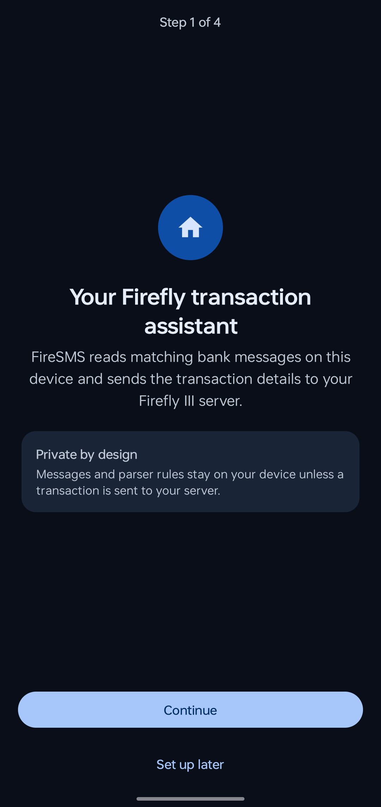
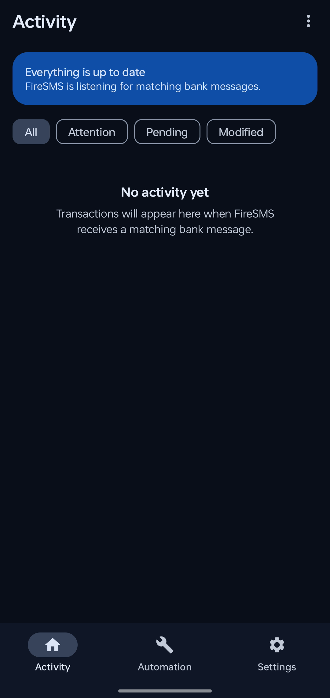
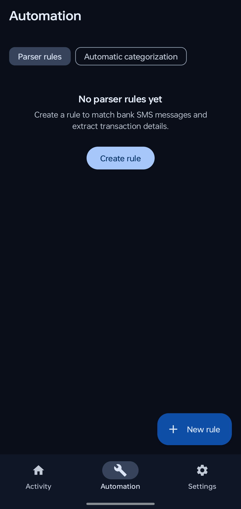
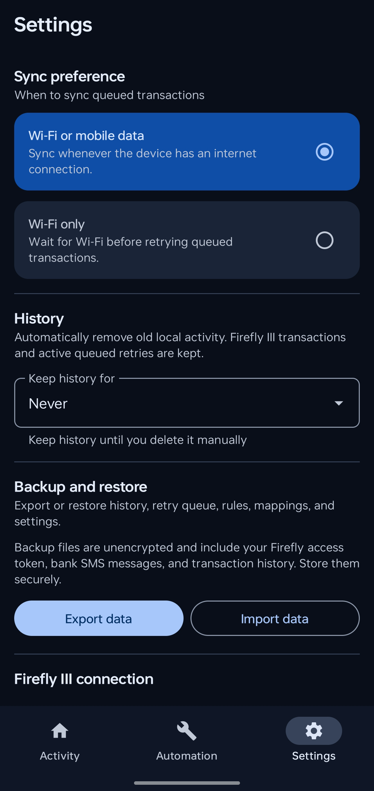

# FireSMS

FireSMS is an open-source Android app that turns matching bank SMS messages into transactions in your self-hosted [Firefly III](https://www.firefly-iii.org/) instance.

It runs on-device, watches only SMS senders that match your configured parser rules, extracts transaction data with regular expressions, and sends the resulting transaction to Firefly III using your personal access token.

> **Privacy note:** FireSMS handles sensitive financial SMS messages and your Firefly III access token. Review [PRIVACY.md](PRIVACY.md) before using backups, sharing examples, or contributing test data.

## Features

- Receive and process matching SMS messages on Android.
- Create Firefly III transactions automatically.
- Configure parser rules with Kotlin/Java-compatible regular expressions.
- Import AI-generated parser-rule JSON after review.
- Assign source/destination accounts, transaction type, date, notes, category, and budget.
- Automatically categorize transactions using title-mapping rules.
- Retry failed Firefly III submissions with WorkManager.
- Review unparsed messages and teach FireSMS new rules.
- Edit created transactions from the app.
- Export and restore app data, rules, mappings, retry queue, and settings.
- Configure local history retention.

## Screenshots

| Onboarding | Activity | Automation | Settings |
|---|---|---|---|
|  |  |  |  |

## Requirements

### For users

- Android device running Android 8.0/API 26 or newer.
- SMS permission granted to FireSMS.
- A reachable Firefly III server.
- A Firefly III personal access token.

### For developers

- JDK 17.
- Android SDK with API 35 installed.
- Android Studio or the included Gradle wrapper.

See [docs/BUILDING.md](docs/BUILDING.md) for full build instructions.

## How it works

```text
Incoming SMS
  -> sender regex match
  -> parser rule body regex
  -> ParsedTransaction
  -> Firefly III API
  -> local activity log / retry queue
```

Only enabled parser rules are considered. If an SMS sender does not match any enabled sender pattern, FireSMS ignores it.

See [docs/ARCHITECTURE.md](docs/ARCHITECTURE.md) for a deeper overview.

## Getting started as a user

1. Install or build FireSMS.
2. Open the app and complete onboarding.
3. Grant SMS permission.
4. Enter your Firefly III server URL and personal access token.
5. Create your first parser rule under **Automation**.
6. Check **Needs attention** for messages FireSMS could not parse.

See [docs/USER_GUIDE.md](docs/USER_GUIDE.md) for detailed setup instructions.

## Parser rules

FireSMS parser rules use:

- sender regex to decide which SMS senders are handled,
- body regex with named groups to extract values,
- templates such as `{{amount}}` and `{{merchant}}`,
- transaction type values: `withdrawal`, `deposit`, or `transfer`.

See [docs/PARSER_RULES.md](docs/PARSER_RULES.md) for examples and the importable JSON format.

## Building from source

Common commands:

```bash
./gradlew testDebugUnitTest
./gradlew lintDebug
./gradlew assembleDebug
```

If Gradle reports that the Android SDK location cannot be found, configure `ANDROID_HOME` or create a local `local.properties` file with `sdk.dir=/path/to/android/sdk`.

Full instructions: [docs/BUILDING.md](docs/BUILDING.md).

## Contributing

Contributions are welcome. Please read [CONTRIBUTING.md](CONTRIBUTING.md) before opening issues or pull requests.

Important: never include real SMS bodies, bank account numbers, Firefly III tokens, private server URLs, or exported backup files in issues, PRs, screenshots, or tests.

## Security

Please report security issues privately. See [SECURITY.md](SECURITY.md).

## License

FireSMS is licensed under the Apache License 2.0. See [LICENSE](LICENSE).
